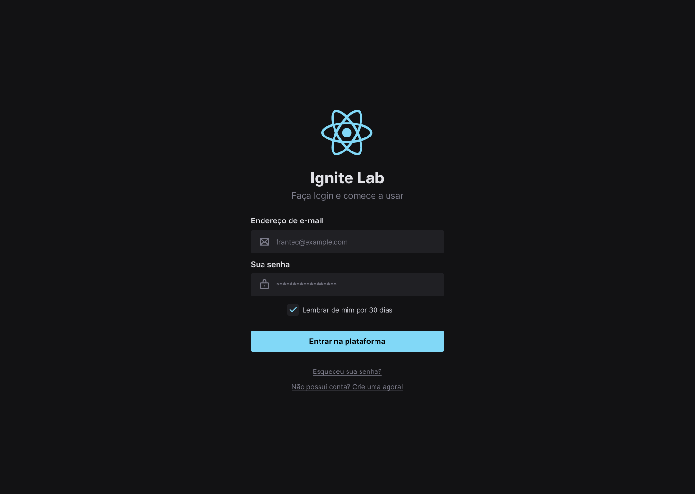

# Ignite Lab Design Systems



Esta aplicação foi desenvolvida durante o IginteLab da @Rokectseat.

## Aprendizado

Criar a base visual do Design System no Figma, definir quais tokens utilizaremos e os componentes que farão parte da biblioteca em React.

Mão na massa! Na segunda aula iremos exportar os tokens e componentes do Figma para o código criando a base do projeto em React e a documentação utilizando Storybook

## Requerimentos

- [Node](https://nodejs.org)
- [npm](https://www.npmjs.com)
- Requerimentos do [React](https://reactjs.org)

## Tech Stack
- HTML
- CSS
- [React](https://reactjs.org)
- [Tailwindcss](https://tailwindcss.com/)
- [Radix-UI](https://www.radix-ui.com/)
- [Storybook](https://storybook.js.org/)
- [TypeScript](https://www.typescriptlang.org)

## License
[MIT](https://choosealicense.com/licenses/mit/)

## Instalação

```bash
npm install
```

## Run
```
npm run dev
npm run storybook
```